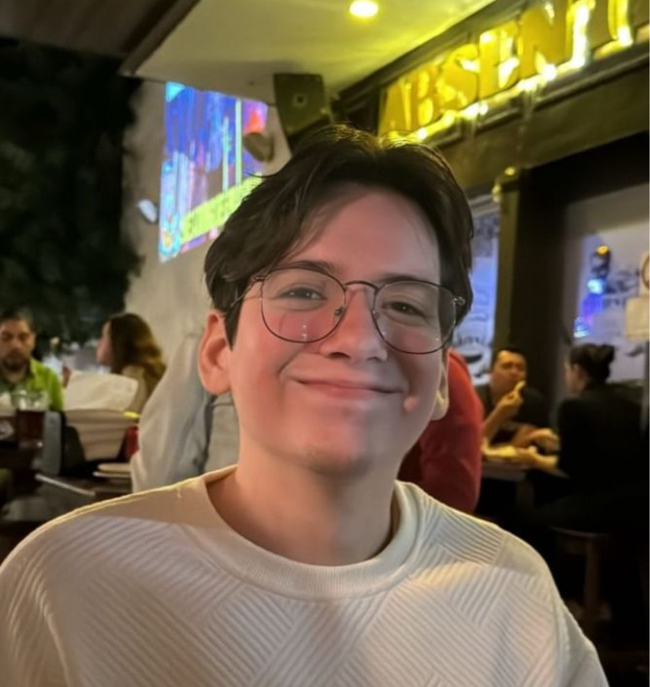
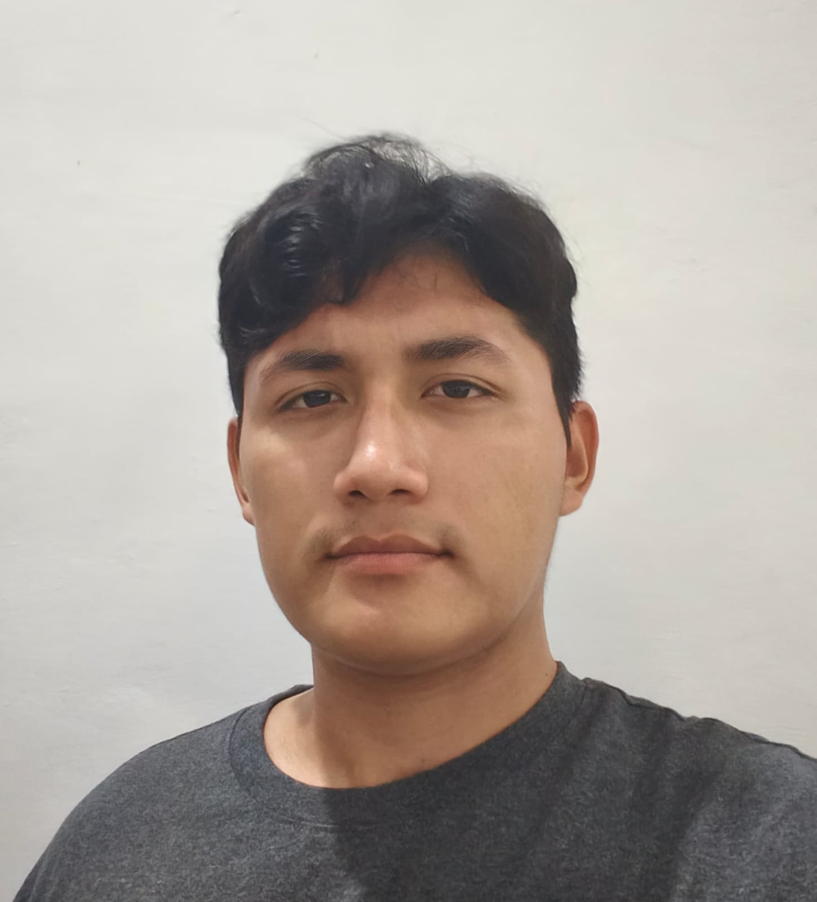
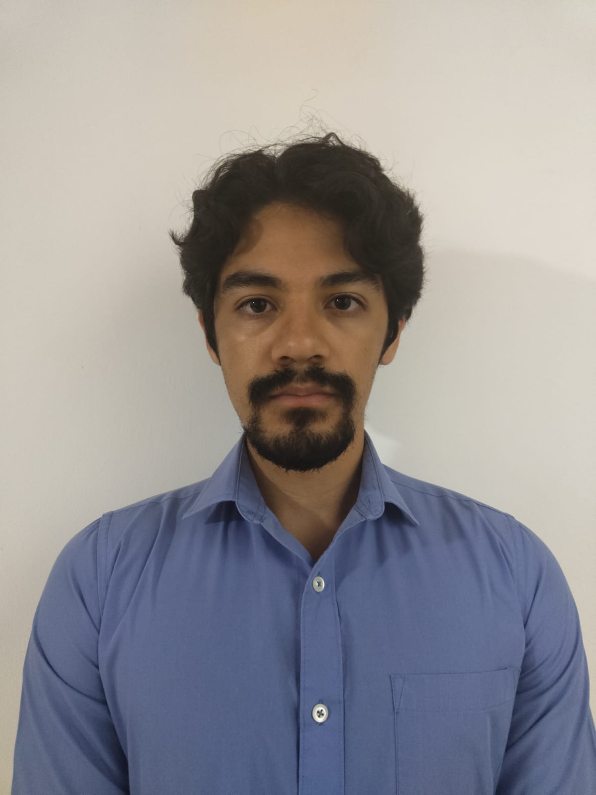

# Proyecto Desarrollo de Aplicaciones Web

Este proyecto es desarrollado como parte del curso de Desarrollo de Aplicaciones Web del quinto semestre de la Facultad de Matemáticas. 

## Integrantes del Proyecto

| Nombre del Integrante | Foto |
|----------------------|------|
| Esteban Canto Vázquez |  |
| José Manuel Ceballos Medina |  |
| Ángel Leandro Puch Uribe |  |
| Mauricio Emiliano Ramírez Ceciliano |  |
| Becky Zhu Wu |  |

